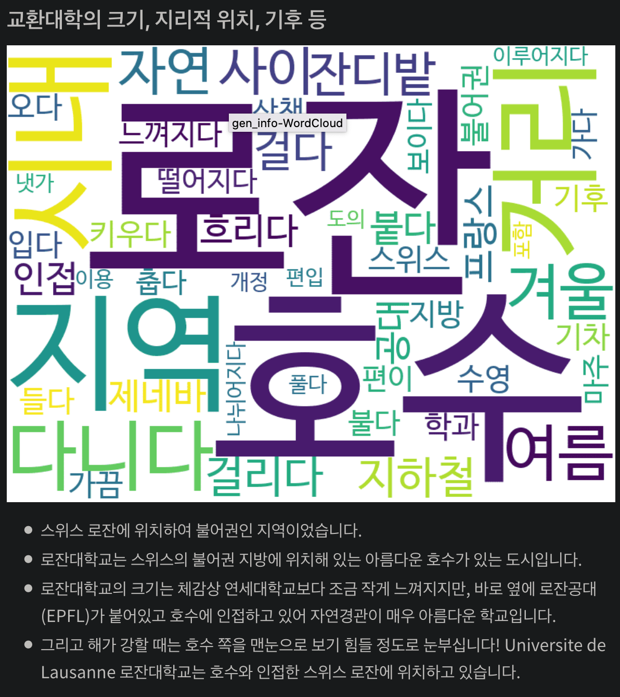

# snoop2head's portfolio

**Learn enough to be dangerous to build an idea. Concept it, show it to the world.**

- Name: Young Jin Ahn
- Email: young_ahn@yonsei.ac.kr
- Blog: https://snoop2head.github.io/

---

## Multimodal Projects

### [ KoDALLE: Text to Fashion](https://github.com/KR-HappyFace/KoDALLE)

**Generating dress outfit images based on given input text** | [📄 Presentation](https://github.com/KR-HappyFace/KoDALLE/blob/main/README.pdf)

- Role
  - **Created training pipeline from VQGAN through DALLE.**
  - **Maintained versions of 1 million pairs image-caption dataset.**
  - Constructed inference pipeline from VQGAN through DALLE.
  - Established live demo for the KoDALLE on Huggingface Space.
- Skills
  - DALLE: transformers, torch
  - VQGAN: torch, torchvision
  - Backend demo server: fastapi

---

## Natural Language Processing Projects

### [ KLUE-RBERT](https://github.com/snoop2head/KLUE-RBERT)

**Extracting relations between subject and object entity in KLUE Benchmark dataset**  | [✍️ Blog Post](https://snoop2head.github.io/Relation-Extraction-Code/)

- Role
  - **Finetuned RoBERTa model according to RBERT structure in pytorch.** 
  - Composed custom dataset, trainer, inference code in pytorch.
  - Applied stratified k-fold cross validation for the custom trainer.
- Skills
  - Relation Extraction: transformers, torch
  - Wrangling: pandas, numpy

### [ Conditional Generation with KoGPT](https://github.com/snoop2head/KoGPT-Joong-2)

**Sentence generation with given emotion conditions** | [🤗 Huggingface Demo](https://huggingface.co/spaces/snoop2head/KoGPT-Conditional-Generation)

- Role
  - **Finetuned KoGPT-Trinity with conditional emotion labels.**
  - Created conditional emotion dataset and inference code in pytorch.
  - Maintained huggingface hosted model and live demo.
- Skills
  - Generation: transformers, torch
  - Wrangling: pandas, numpy

### [ Emotional Instagram Posts(글스타그램) Dataset](https://github.com/Keracorn/geulstagram)

**Created Emotional Instagram Posts(글스타그램) dataset** | [📄 Presentation](https://github.com/Keracorn/geulstagram/blob/master/README.pdf)

- Role
  - **Managed version control for the project Github Repository.**
  - Converted Korean text on image file to text file using Google Cloud Vision API.
- Skills
  - Collection: Google Vision API, instagram-crawler
  - Wrangling: pandas

### [ Machine Reading Comprehension in Naver Boostcamp](https://snoop2head.github.io/Custom-MRC-Reader/)

**Retrieved and extracted answers from wikipedia texts for given question** | [✍️ Blog Post](https://snoop2head.github.io/Custom-MRC-Reader/)

- Role
  - **Attached bidirectional LSTM layers to the backbone transformers model to extract answers.**
  - **Divided EM benchmark into start token prediction accuracy and end token prediction accuracy.**
  - Compared performances accross learning rates, optimizers and loss critera.
- Skills
  - Extractive Reader: transformers, torch
  - Wrangling: pandas, numpy

### [ Mathpresso Corporation Joint Project](https://github.com/snoop2head/Mathpresso_Classification)

**Corporate joint project for mathematics problems classification task** | [📄 Presentation](https://github.com/snoop2head/Mathpresso_Classification/blob/main/YBIGTA_%EB%A7%A4%EC%93%B0%ED%94%84%EB%A0%88%EC%86%8C_%EB%AA%BD%EB%8D%B0%EC%9D%B4%ED%81%AC_Final.pdf)

- Role
  - **Preprocessed Korean mathematics problems dataset based on EDA.**
  - Maintained version of preprocessing module.
- Skills: pandas, numpy

---

## Computer Vision Projects

### [ Realtime Turtleneck Prevention](https://github.com/snoop2head/ml_classification_tutorial)

**Real-time desk posture detection through webcam** | [📷 Demo Video](https://www.youtube.com/watch?v=6z_TJaj71io&t=459s)

- Role
  - **Created real-time detection window using opencv-python.**
  - Converted image dataset into Yaw/Pitch/Roll numerical dataset using RetinaFace model.
  - Trained and optimized random forest classification model with precision rate of 93%.
- Skills: opencv-python, scikit-learn

### [ ELimNet](https://github.com/snoop2head/ELimNet)

**Elimination based Lightweight Neural Net with Pretrained Weights** | [📄 Presentation](https://github.com/snoop2head/ELimNet/blob/main/README.pdf)

- Role
  - **Constructed lightweight CNN model with less than 1M #params** by removing top layers from pretrained CNN models.
  - Assessed on Trash Annotations in Context(TACO) Dataset sampled for 6 classes with 20,851 images.
  - Compared metrics accross VGG11, MobileNetV3 and EfficientNetB0.
- Skills: torch, torchvision, wandb

### [ Face Mask, Age, Gender Classification in Naver Boostcamp](https://github.com/boostcampaitech2/image-classification-level1-23)

Identifying 18 classes from given images: Age Range(3 classes), Biological Sex(2 classes), Face Mask(3 classes) | [✍️ Blog Post](https://snoop2head.github.io/Mask-Age-Gender-Classification-Competition/)

- Role
  - **Optimized combination of backbone models, losses and optimizers.**
  - Created additional dataset with labels(age, sex, mask) to resolve class imbalance.
  - Cropped facial characteristics with MTCNN and RetinaFace to reduce noise in the image.
- Skills: torch, torchvision, timm

---

## Web Projects

### [ Exchange Program Overview Website](https://github.com/snoop2head/yonsei-exchange-program)

**Overview for student life in foreign universities** | [✈️ Website Demo](https://yonsei-exchange.netlify.app/)

- KPIs
  - **6000 Pageviews within 6 Months**
  - **4 minutes+ of Average Retention Time**
- Role
  - Collected and preprocessed 11200 text review data from the Yonsei website.
  - Visualized department distribution and weather information using matplotlib.
  - Sentiment analysis on satisfaction level for foreign universities with pretrained BERT model.
  - Clustered universities with provided curriculum with K-means clustering.
- Skills
  - Wrangling: pandas, numpy, statistic
  - Clustering: scikit-learn, matplotlib
  - Summarizing: textrankr, konlpy, soynlp
  - Web: Gatsby.js, GraphQL, Netlify

### [ fitcuration website](https://github.com/snoop2head/fitcuration-django)

**Search-based exercise retrieval web service** | [📷 Demo Video](https://youtu.be/kef0CxzMANo?t=38)

- Role
  - **Built retrieval algorithm based on search keyword using TF-IDF.**
  - Deployed website using Docker, AWS RDS, AWS S3, AWS EBS
  - Constructed backend using Django, Django ORM & PostgreSQL.
  - Composed client-side using Sass, Tailwind, HTML5.

- Skills
  - Backend: Django, Django ORM & PostgreSQL
  - Client: Sass, Tailwind, HTML5
  - Deployment: Docker, AWS RDS, AWS S3, AWS EBS
  - Natural Language Processing: scikit-learn, gensim, konlpy, soynlp

---

## Quantitative Finance Projects

### [ Stock Price Prediction Competition @DACON](https://github.com/snoop2head/elastic-stock-prediction)

**Top 5% in Dacon's *Stock Price Prediction Competition*** | [✍️ Blog Post](https://snoop2head.github.io/Dacon-Stock-Price-Competition/)

- Role
  - **Validated the model's performance according to different periods** for the sake of robustness.
  - Applied cross validation by using ElasticNetCV model.
  - Completed the model's inference for the evaluation period.
  - Tested ARIMA, RandomforestRegressor and ElasticNetCV.
- Skills
  - Machine Learning: scikit-learn
  - Quantitative Finance: ta-lib, finance-datareader
  - Wrangling: pandas, numpy

### [ Korean Spinoff Event Tracker](https://github.com/snoop2head/spinoff_hunter_kor)

Get financial data of public companies involved in spinoff events on Google Spreadsheet | [🧩 Dataset Demo](https://docs.google.com/spreadsheets/d/1chJ2NKHVc0gKjsMaQI1UHEPxdjneV1ZWaTGHseQvxP4/edit?usp=sharing)

- Role: Crawl Data, Wrangle Financial Dataset, Display on Google Sheets
- Skills
  - Collection: BeautifulSoup4
  - Wrangling: pandas

---

## Opensource Contributions

### [ docker/docker.github.io](https://github.com/docker/docker.github.io)

**Updated PostgreSQL initialization for "Quickstart: dockerizing django" documentation** | [🐳 Pull Request](https://github.com/docker/docker.github.io/pull/10624)

- Duration: March 2020 ~ April 2020
- Skills
  - Backend: Django, Django ORM & PostgreSQL
  - Deployment: Docker, docker-compose

### [ NVlabs/stylegan2-ada-pytorch](https://github.com/NVlabs/stylegan2-ada-pytorch)

**Fixed torch version comparison fallback error for source repo of NVIDIA Research** | [✍️ Pull Request](https://github.com/NVlabs/stylegan2-ada-pytorch/pull/197)

- Duration: November 2020
- Skills: torch, torchvision

---

## ETC

### [ Indigo](https://github.com/snoop2head/indigo)

**Don't miss concerts for your favorite artists with KakaoTalk Chatbot** | [📷 Demo Video](https://www.youtube.com/watch?v=uIOWqumaOD4)

- Role
  - Created API server for KakaoTalk chatbot
  - Visualized concert schedules on user's Google Calendar
  - Created / Updated events in Google Calendar.
- Skills
  - Backend: Flask, Pymongo & MongoDB
  - Deployment: AWS EC2

### [ Covid19 Confirmed Cases Prediction](https://github.com/Rank23/COVID19)

**Predict the spread of COVID-19 in early stage after its entrance to country.**

- Role
  - Fixed existing errors on Github Repository.
  - Wrote footnotes in both English and Korean.
- Skills
  - Wrangling: pandas
- Precision and Results
  - ±5% accuracy for one-day prediction.
  - ±10% accuracy for 30-day prediction.

---

## Skillsets

**Data Analysis**

- Data Analysis Library: pandas, numpy
- Deep Learning: pytorch, transformers
- Machine Learning: scikit-learn, gensim

**Backend**

- Python / Django - Django ORM, CRUD, OAuth
- Python / FastAPI(uvicorn) - CRUD API
- Python / Flask - CRUD API

**Client**

- HTML / Pug.js
- CSS / Sass, Tailwind, Bulma
- JavaScript / ES6

**Deployment**

- Docker, docker-compose
- AWS EC2, Google Cloud App Engine
- AWS S3, RDS (PostgreSQL)
- AWS Elastic Beanstalk, CodePipeline
