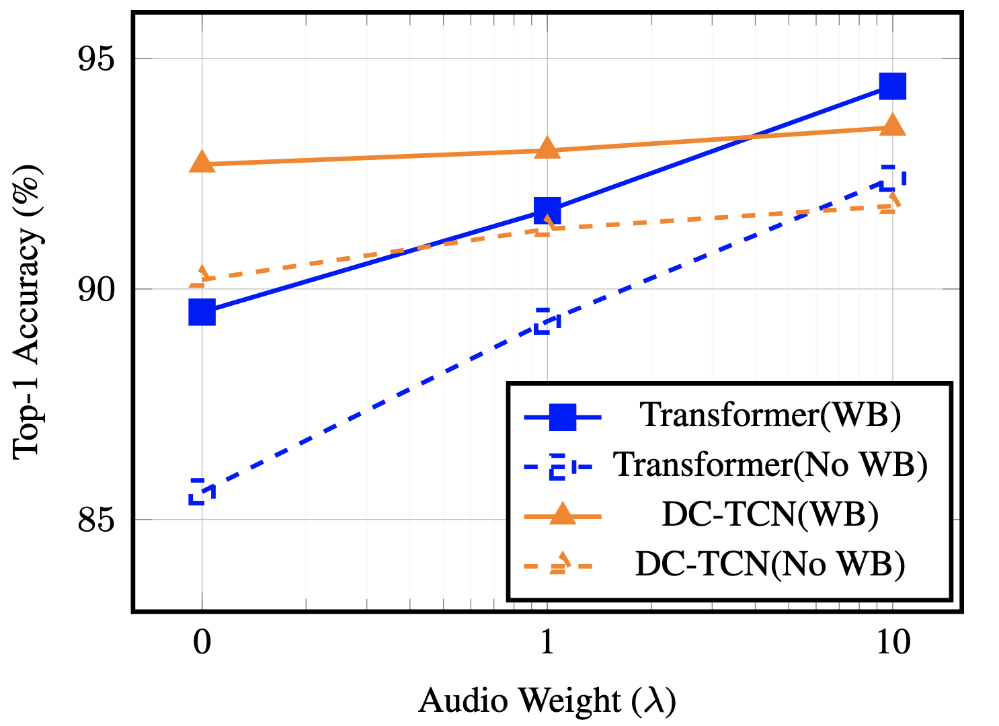

# snoop2head's portfolio

**Capture Questions, Answer with Code**

- Name: Young Jin Ahn
- Email: snoop2head@kaist.ac.kr
- Blog: https://snoop2head.github.io/

---

## 📖 Education

### Korea Advanced Institute of Science and Technology (KAIST)

 Master of Science in Artificial Intelligence 

  <ul>
    <li>Machine Learning for AI (A+)</li>
		<li>Advanced Deep Learning (A-)</li>
		<li>Programming for AI (A+)</li>
    <li>Scientific Writing (P)</li>
    <li>Advanced Machine Learning for AI</li>
    <li>Deep Reinforcement Learning</li>
    <li>Machine Learning for Healthcare</li>
    <li>Large Language Models</li>
</ul>

### Yonsei University

 Bachelor of Arts in Economics & Minor in Applied Statistics

  <ul>
    <li>INTRODUCTION TO STATISTICS (A0)</li>
    <li>STATISTICAL METHOD (A+)</li>
    <li>CALCULUS (B+)</li>
    <li>LINEAR ALGEBRA (B+)</li>
    <li>MATHEMATICAL STATISTICS 1 (A+)</li>
    <li>LINEAR REGRESSION (B+)</li>
    <li>R AND PYTHON PROGRAMMING (A+)</li>
    <li>DATA STRUCTURE (B+)</li>
    <li>SPECIAL PROBLEMS IN COMPUTING (A0)</li>
    <li>SOCIAL INFORMATICS (A+)</li>
    <li>TIME SERIES ANALYSIS (A+)</li>
    <li>THEORY AND PRACTICE OF DEEP LEARNING (A+)</li>
  </ul>

## 🏆 Competition Awards

|              Host / Platform               |                                                                    Topic / Task                                                                     |        Result        |                                                                                Repository                                                                                 | Year |
| :----------------------------------------: | :-------------------------------------------------------------------------------------------------------------------------------------------------: | :------------------: | :-----------------------------------------------------------------------------------------------------------------------------------------------------------------------: | :--: |
| National IT Industry Promotion Agency |                           [Machine Reading Compehension](https://aichallenge.or.kr/competition/detail/1/task/5/taskInfo)                            | 🥈 2nd  (2/26)  |             [ MRC_Baseline](https://github.com/QuoQA-NLP/MRC_Baseline)              | 2022 |
|           Ministry of Statistics           | [Korean Standard Industry Classification](https://data.kostat.go.kr/sbchome/bbs/boardList.do?boardId=SBCSBBS_000000025000&curMenuNo=OPT_09_02_00_0) | 🎖 7th  (7/311)  |                                                                                     -                                                                                     | 2022 |
|                   Dacon                    |                   [KLUE benchmark Natural Language Inference](https://dacon.io/competitions/official/235875/overview/description)                   | 🥇 1st  (1/468) |                                                [🌐 KLUE NLI](https://dacon.io/competitions/official/235875/codeshare/4589)                                                | 2022 |
|              Dacon & AI Frenz              |                          [Python Code Clone Detection](https://dacon.io/competitions/official/235900/overview/description)                          | 🥉 3rd  (3/337) |           [ CloneDetection](https://github.com/sangHa0411/CloneDetection)           | 2022 |
|             Dacon & CCEI Korea             |                    [Stock Price Forecast on KOSPI & KOSDAQ](https://dacon.io/competitions/official/235857/overview/description)                     | 🎖 6th  (6/205)  | [ elastic-stock-prediction](https://github.com/snoop2head/elastic-stock-prediction) | 2021 |

\*\*Dacon is Kaggle alike competition platform in Korea.

---

## 🛠 Multimodal Projects

### [ Cross-Modal Token Synchronization for Visual Speech Recognition (2023)](https://github.com/kaist-AILab/cmts)

|                      Framework Overview                      |          Influence of Audio Reconstruction Loss (λ)          |
| :----------------------------------------------------------: | :----------------------------------------------------------: |
|  |  |

Visual Speech Recognition (VSR) stands at the intersection of computer vision and natural language processing, aiming to decipher spoken content from visual cues. A predominant challenge in VSR is the misalignment of graphemes in ground truth annotations, which often inadequately represent auditory nuances. To address this, we introduce the Cross-Modal Token Synchronization (CMTS) framework. Our method non-autoregressively generates discrete audio tokens from silent video frames, ensuring a synchronized bridge between visual and auditory modalities in one forward pass. Importantly, our framework seamlessly integrates with established temporal architectures, including Transformer, Conformer, and Temporal Convolutional Networks (TCN), without necessitating structural alterations. Evaluations on standard lip reading datasets confirm that our method achieves state-of-the-art results, demonstrating effectiveness of the approach.

### [ KoDALLE: Text to Fashion (2021)](https://github.com/KR-HappyFace/KoDALLE)

**Generating dress outfit images based on given input text** | [📄 Presentation](https://github.com/KR-HappyFace/KoDALLE/blob/main/README.pdf)

- **Created training pipeline from VQGAN through DALLE**
- **Maintained versions of 1 million pairs image-caption dataset.**
- Trained VQGAN and DALLE model from the scratch.
- Established live demo for the KoDALLE on Huggingface Space via FastAPI.

## 🔐 Differential Privacy

### [ Language Model Memorization (2022)](https://github.com/yonsei-cysec/Language_Model_Memorization)

**Implementation of Carlini et al(2020) [Extracting Training Data from Large Language Models](https://arxiv.org/abs/2012.07805)**

- Accelerated inference speed with parallel Multi-GPU usage.
- Ruled out 'low-quality repeated generations' problem of the paper with repetition penalty and with ngram restriction.

### [ Membership Inference Attack (2022)](https://github.com/yonsei-cysec/Membership_Inference_Attack)

**Implementation of Shokri et al(2016) [Membership Inference Attacks Against Machine Learning Models](https://arxiv.org/pdf/1610.05820.pdf)**

- Prevented overfitting of shadow models' by adding early stop, regularizing with weight decay and allocating train/val/test datasets.
- Referenced [Carlini et al(2021)](https://arxiv.org/abs/2112.03570) to conduct further research on different types of models and metrics.
- Reproduced attack metrics as the following.

| MIA Attack Metrics | Accuracy | Precision | Recall | F1 Score |
| :----------------: | :------: | :-------: | :----: | :------: |
|      CIFAR10       |  0.7761  |  0.7593   | 0.8071 |  0.7825  |
|      CIFAR100      |  0.9746  |  0.9627   | 0.9875 |  0.9749  |

|                                                   MIA ROC Curve CIFAR10                                                    |                                                    MIA ROC Curve CIFAR100                                                    |
| :------------------------------------------------------------------------------------------------------------------------: | :--------------------------------------------------------------------------------------------------------------------------: |
|  |  |

## 💬 Natural Language Processing Projects

### [ KoQuillBot (2022)](https://github.com/QuoQA-NLP/KoQuillBot) & [ T5 Translation (2022)](https://github.com/QuoQA-NLP/T5_Translation)

**Paraphrasing tool with round trip translation utilizing T5 Machine Translation.** | [🤗 KoQuillBot Demo](https://huggingface.co/spaces/QuoQA-NLP/KoQuillBot) & [🤗 Translator Demo](https://huggingface.co/spaces/QuoQA-NLP/QuoQaGo)

|                   | BLEU Score |                                         Translation Result                                         |
| :---------------: | :--------: | :------------------------------------------------------------------------------------------------: |
| Korean ➡️ English |   45.15    | [🔗 Inference Result](https://huggingface.co/datasets/QuoQA-NLP/KE-T5-Ko2En-Base-Inference-Result) |
| English ➡️ Korean |     -      |                                                 -                                                  |

### [ Deep Encoder Shallow Decoder (2022)](https://github.com/snoop2head/Deep-Encoder-Shallow-Decoder)

**Implementation of Kasai et al(2020) [Deep Encoder, Shallow Decoder: Reevaluating Non-autoregressive Machine Translation](https://arxiv.org/abs/2006.10369)** | [📄 Translation Output](https://docs.google.com/spreadsheets/d/1IqEuRuEpphPEX3ni1m0EwqYuOU4E4t4-jC6uullpJhE/edit#gid=204599913)

- Composed custom dataset, trainer, inference code in pytorch and huggingface.
- Trained and hosted encoder-decoder transformers model using huggingface.

|                   | BLEU Score |                                                      Translation Result                                                       |
| :---------------: | :--------: | :---------------------------------------------------------------------------------------------------------------------------: |
| Korean ➡️ English |   35.82    | [🔗 Inference Result](https://docs.google.com/spreadsheets/d/1IqEuRuEpphPEX3ni1m0EwqYuOU4E4t4-jC6uullpJhE/edit#gid=204599913) |
| English ➡️ Korean |     -      |                                                               -                                                               |

### [ KLUE-RBERT (2021)](https://github.com/snoop2head/KLUE-RBERT)

**Extracting relations between subject and object entity in KLUE Benchmark dataset** | [✍️ Blog Post](https://snoop2head.github.io/Engineering/Relation-Extraction-Code/)

- Finetuned RoBERTa model according to RBERT structure in pytorch.
- Applied stratified k-fold cross validation for the custom trainer.

### [ Conditional Generation with KoGPT (2021)](https://github.com/snoop2head/KoGPT-Joong-2)

**Sentence generation with given emotion conditions** | [🤗 Huggingface Demo](https://huggingface.co/spaces/snoop2head/KoGPT-Conditional-Generation)

- Finetuned KoGPT-Trinity with conditional emotion labels.
- Maintained huggingface hosted model and live demo.

### [ Machine Reading Comprehension in Naver Boostcamp (2021)](https://github.com/boostcampaitech2/mrc-level2-nlp-15)

**Retrieved and extracted answers from wikipedia texts for given question** | [✍️ Blog Post](https://snoop2head.github.io/Engineering/Custom-MRC-Reader/)

- Attached bidirectional LSTM layers to the backbone transformers model to extract answers.
- Divided benchmark into start token prediction accuracy and end token prediction accuracy.

### [ Mathpresso Corporation Joint Project (2020)](https://github.com/snoop2head/Mathpresso_Classification)

**Corporate joint project for mathematics problems classification task** | [📄 Presentation](https://github.com/snoop2head/Mathpresso_Classification/blob/main/YBIGTA_%EB%A7%A4%EC%93%B0%ED%94%84%EB%A0%88%EC%86%8C_%EB%AA%BD%EB%8D%B0%EC%9D%B4%ED%81%AC_Final.pdf)

- Preprocessed Korean mathematics problems dataset based on EDA.
- Maintained version of preprocessing module.

### [ Constructing Emotional Instagram Posts Dataset (2019)](https://github.com/Keracorn/geulstagram)

**Created Emotional Instagram Posts(글스타그램) dataset** | [📄 Presentation](https://github.com/Keracorn/geulstagram/blob/master/README.pdf)

- Managed version control for the project Github Repository.
- Converted Korean texts on image file into text file using Google Cloud Vision API.

## 👀 Computer Vision Projects

### [ DotNeuralNet (2023)](https://github.com/snoop2head/DotNeuralNet)

**Light-weight Neural Network for Optical Braille Recognition in the wild & on the book.** | [🤗 Huggingface Demo](https://huggingface.co/spaces/snoop2head/braille-detection)

- Classified multi label one-hot encoded labels for raised braille patterns.
- Pseudo-labeled Natural Scene Braille dataset.
- Trained single stage object detection YOLO models for braille cell recognition.

### [ ElimNet (2021)](https://github.com/snoop2head/ELimNet)

**Elimination based Lightweight Neural Net with Pretrained Weights** | [📄 Presentation](https://github.com/snoop2head/ELimNet/blob/main/README.pdf)

- Constructed lightweight CNN model with less than 1M #params by removing top layers from pretrained CNN models.
- Assessed on Trash Annotations in Context(TACO) Dataset sampled for 6 classes with 20,851 images.
- Compared metrics accross VGG11, MobileNetV3 and EfficientNetB0.

### [ Face Mask, Age, Gender Classification in Naver Boostcamp (2021)](https://github.com/boostcampaitech2/image-classification-level1-23)

**Identifying 18 classes from given images: Age Range(3 classes), Biological Sex(2 classes), Face Mask(3 classes)** | [✍️ Blog Post](https://snoop2head.github.io/Engineering/Mask-Age-Gender-Classification-Competition/)

- Optimized combination of backbone models, losses and optimizers.
- Created additional dataset with labels(age, sex, mask) to resolve class imbalance.
- Cropped facial characteristics with MTCNN and RetinaFace to reduce noise in the image.

### [ Realtime Desktop Posture Classification (2020)](https://github.com/snoop2head/ml_classification_tutorial)

**Real-time desk posture classification through webcam** | [📷 Demo Video](https://www.youtube.com/watch?v=6z_TJaj71io&t=459s)

- Created real-time detection window using opencv-python.
- Converted image dataset into Yaw/Pitch/Roll numerical dataset using RetinaFace model.
- Trained and optimized random forest classification model with precision rate of 93%.

## 🕸 Web Projects

### [ Exchange Program Overview Website (2020)](https://github.com/snoop2head/yonsei-exchange-program)

**Overview for student life in foreign universities** | [✈️ Website Demo](https://yonsei-exchange.netlify.app/)

- **3400 Visitors within a year (2021.07 ~ 2022.07)**
- **22000 Pageviews within a year (2021.07 ~ 2022.07)**
- **3 minutes+ of Average Retention Time**

- Collected and preprocessed 11200 text review data from the Yonsei website using pandas.
- Visualized department distribution and weather information using matplotlib.
- Sentiment analysis on satisfaction level for foreign universities with pretrained BERT model.
- Clustered universities with provided curriculum with K-means clustering.
- Hosted reports on universities using Gatsby.js, GraphQL, and Netlify.

### [ fitcuration website (2020)](https://github.com/snoop2head/fitcuration-django)

**Search-based exercise retrieval web service** | [📷 Demo Video](https://youtu.be/kef0CxzMANo?t=38)

- Built retrieval algorithm based on search keyword using TF-IDF.
- Deployed website using Docker, AWS RDS, AWS S3, AWS EBS
- Constructed backend using Django, Django ORM & PostgreSQL.
- Composed client-side using Sass, Tailwind, HTML5.

## 💰 Quantitative Finance Projects

### [ Forecasting Federal Rate with Lasso Regression Model (2022)](https://github.com/snoop2head/Federal-Rate-Prediction)

**Federal Rate Prediction for the next FOMC Meeting**

- Wrangled quantitative dataset with Finance Data Reader.
- Yielded metrics and compared candidate regression models for the adaquate fit.
- Hyperparameter optimization for the candidate models.

### [ Korean Spinoff Event Tracker (2020)](https://github.com/snoop2head/spinoff_hunter_kor)

**Get financial data of public companies involved in spinoff events on Google Spreadsheet** | [🧩 Dataset Demo](https://docs.google.com/spreadsheets/d/1chJ2NKHVc0gKjsMaQI1UHEPxdjneV1ZWaTGHseQvxP4/edit?usp=sharing)

- Wrangled finance dataset which are displayed on Google Sheets

---

## 🏷 Opensource Contributions

### [ NVlabs/stylegan2-ada-pytorch (2021)](https://github.com/NVlabs/stylegan2-ada-pytorch)

**Fixed torch version comparison fallback error for source repo of NVIDIA Research** | [✍️ Pull Request](https://github.com/NVlabs/stylegan2-ada-pytorch/pull/197)

- Skills: torch, torchvision

### [ docker/docker.github.io (2020)](https://github.com/docker/docker.github.io)

**Updated PostgreSQL initialization for "Quickstart: dockerizing django" documentation** | [✍️ Pull Request](https://github.com/docker/docker.github.io/pull/10624)

- Skills: Docker, docker-compose, Django

## 🗄 ETCs

### [ Covid19 Confirmed Cases Prediction (2020)](https://github.com/Rank23/COVID19)

**Predict the spread of COVID-19 in early stage after its entrance to country.**

- Fixed existing errors on Github Repository.
- Wrote footnotes in both English and Korean.
- ±5% accuracy for one-day prediction.
- ±10% accuracy for 30-day prediction.

### [ Indigo (2019)](https://github.com/snoop2head/indigo)

**Don't miss concerts for your favorite artists with KakaoTalk Chatbot** | [📷 Demo Video](https://www.youtube.com/watch?v=uIOWqumaOD4)

- Created API server for KakaoTalk chatbot with Flask, Pymongo and MongoDB.
- Deployed the API server on AWS EC2.
- Visualized concert schedules on user's Google Calendar.
- Created / Updated events in Google Calendar.

---

## 🛠 Skillsets

**Data Analysis and Machine Learning**

- Data Analysis Library: pandas, numpy
- Deep Learning: pytorch, transformers
- Machine Learning: scikit-learn, gensim, xgboost

**Backend**

- Python / Django - Django ORM, CRUD, OAuth
- Python / FastAPI(uvicorn) - CRUD API
- Python / Flask - CRUD API

**Client**

- HTML / Pug.js
- CSS / Sass, Tailwind, Bulma
- JavaScript / ES6

**Deployment**

- Docker, docker-compose
- AWS EC2, Google Cloud App Engine
- AWS S3, RDS (PostgreSQL)
- AWS Elastic Beanstalk, CodePipeline;
